#  Microsoft Entra ID (Azure AD) Administration Lab

This project demonstrates hands-on experience with **Microsoft Entra ID (Azure Active Directory)** using a real Microsoft tenant.

The lab simulates common IT support tasks such as:
- User provisioning
- Role assignment
- Password management
- Device registration
- Security monitoring

---

##  1. Creating a User (Lars Nilsson)

### Basic User Creation
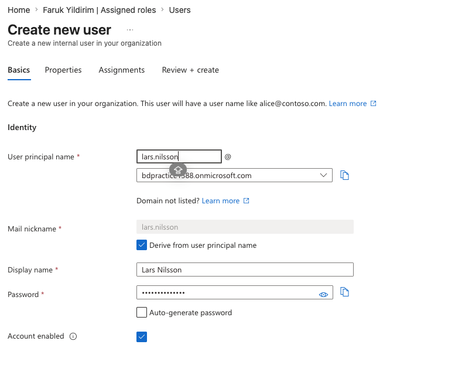

- Created a new user in Entra ID
- Configured:
  - User Principal Name (UPN)
  - Display name
  - Password

Example:
lars.nilsson@bdpractice1388.onmicrosoft.com

---

### User Properties Configuration
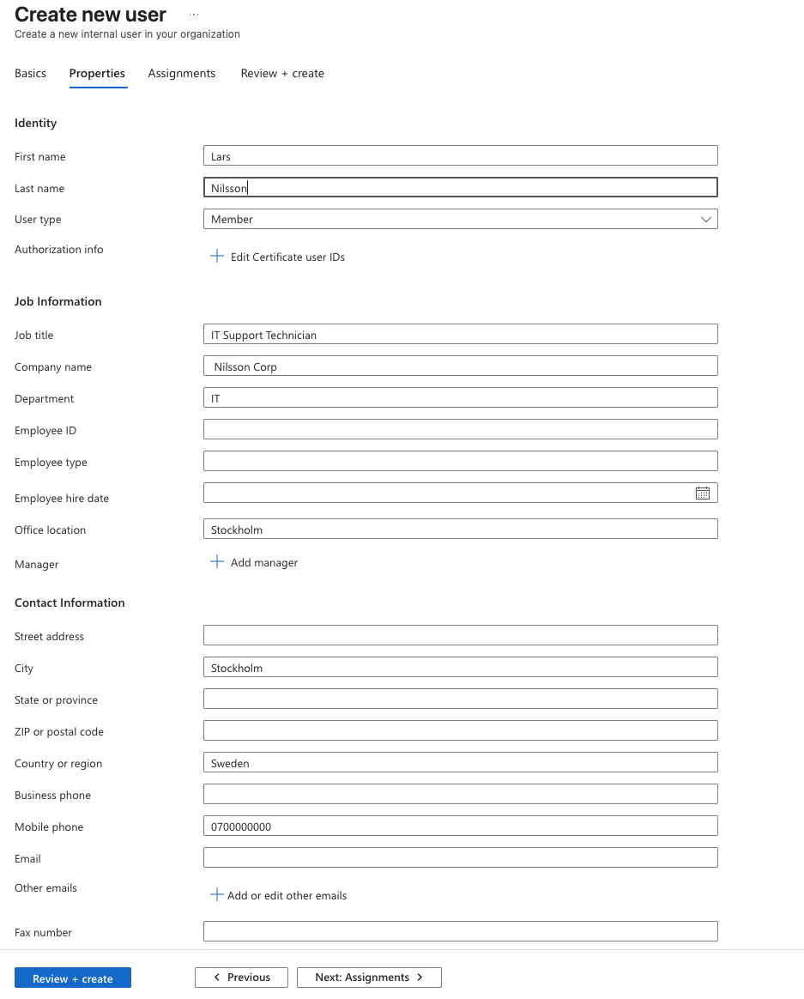

Configured realistic organizational details:
- Job Title: IT Support Technician
- Department: IT
- Company: Nilsson Corp
- Location: Stockholm, Sweden

---

### Role Assignment – Helpdesk Administrator
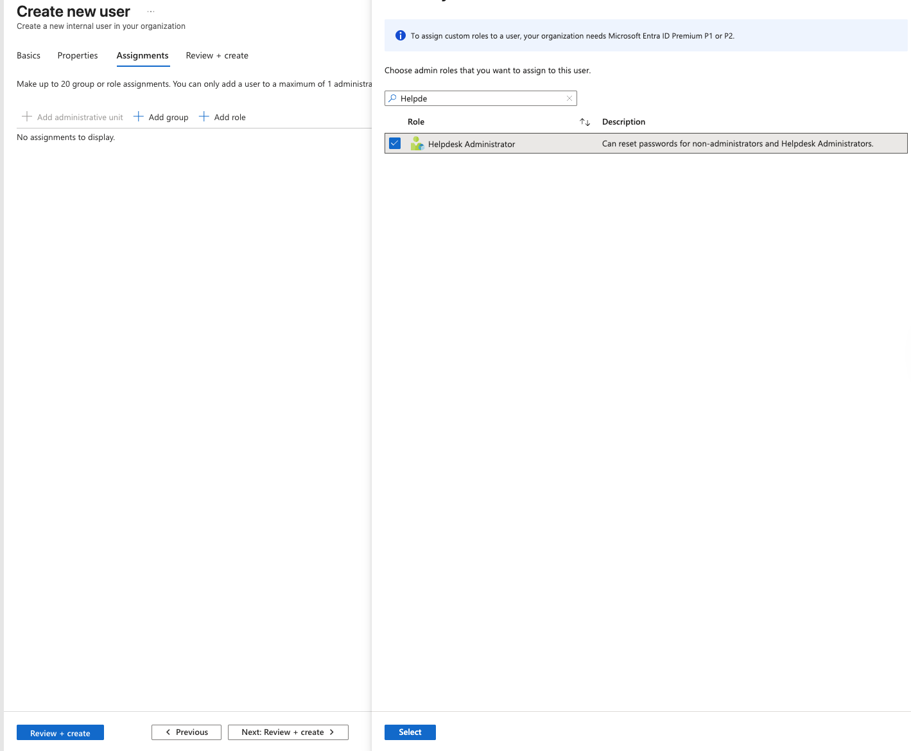

Assigned role:
- Helpdesk Administrator

This role allows:
- Resetting user passwords
- Performing support-level admin tasks

---

### Final Review Before Creation
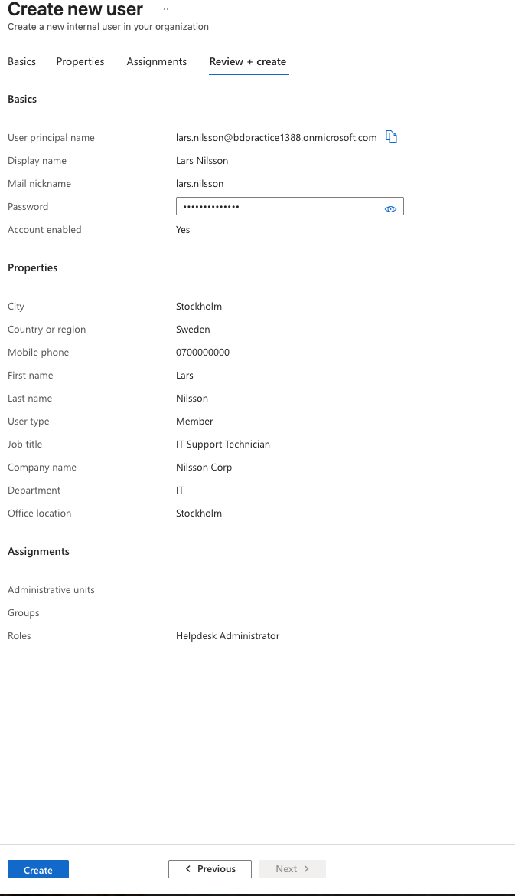

- Verified all user details before creation

---

##  2. Creating Additional Users

### HR User – Anna Lindgren
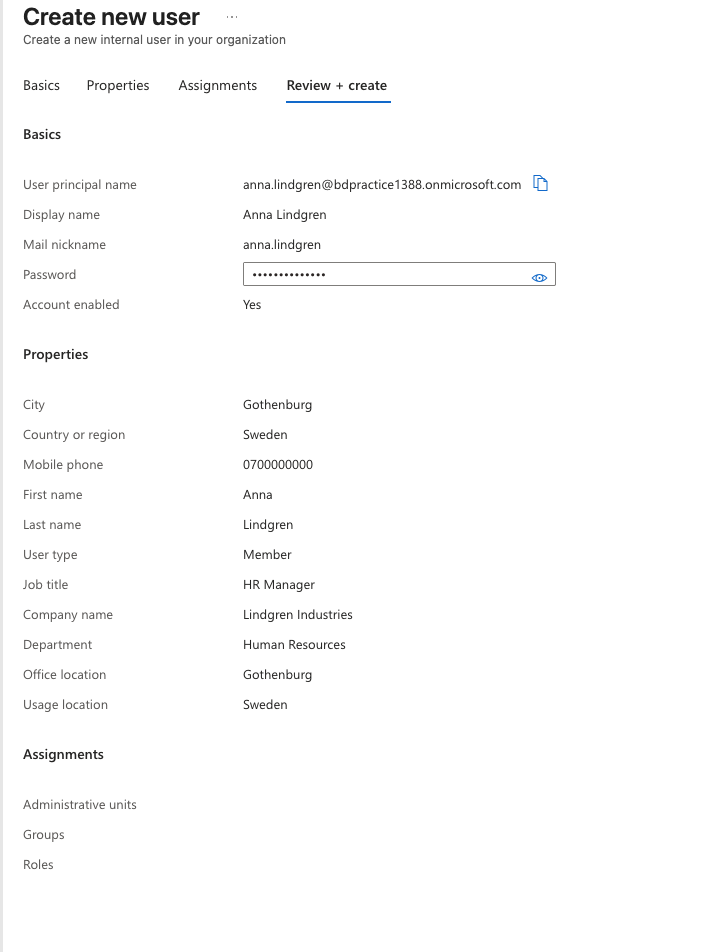

- Department: Human Resources
- Job Title: HR Manager

---

### Sales User – Erik Johansson
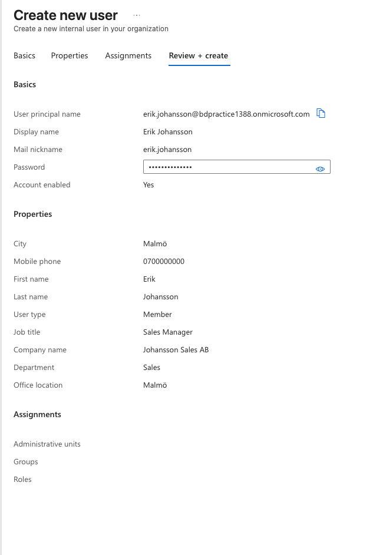

- Department: Sales
- Job Title: Sales Manager

---

##  3. Password Management

### Admin Password Reset
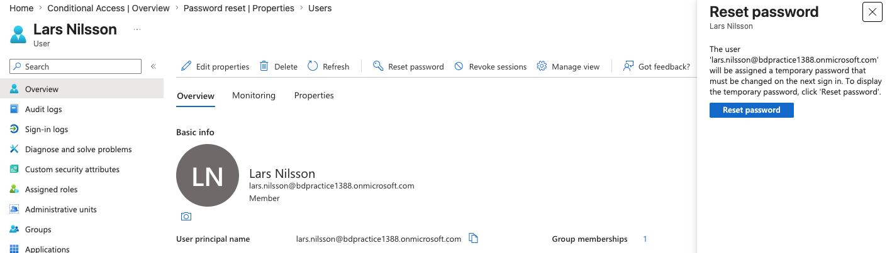

- Performed manual password reset
- Temporary password must be changed on next login

---

### Self-Service Password Reset (SSPR)
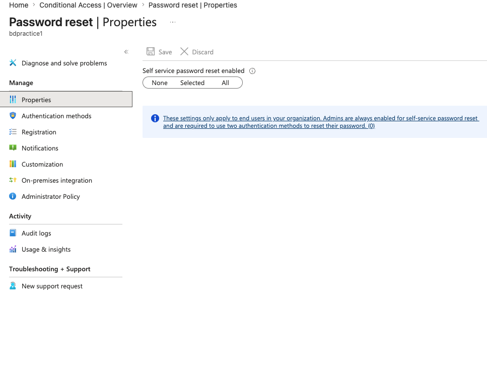

- Explored SSPR settings:
  - None
  - Selected
  - All users

---

##  4. Device Management

### Entra Joined Device (BD-001)
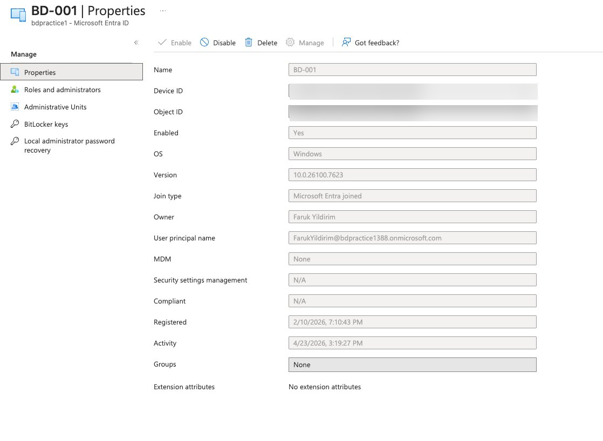

Device details:
- OS: Windows
- Join Type: Microsoft Entra Joined
- Owner assigned
- Status: Enabled

Note:
- MDM = None → Device is not managed by Intune

---

##  5. Conditional Access Overview

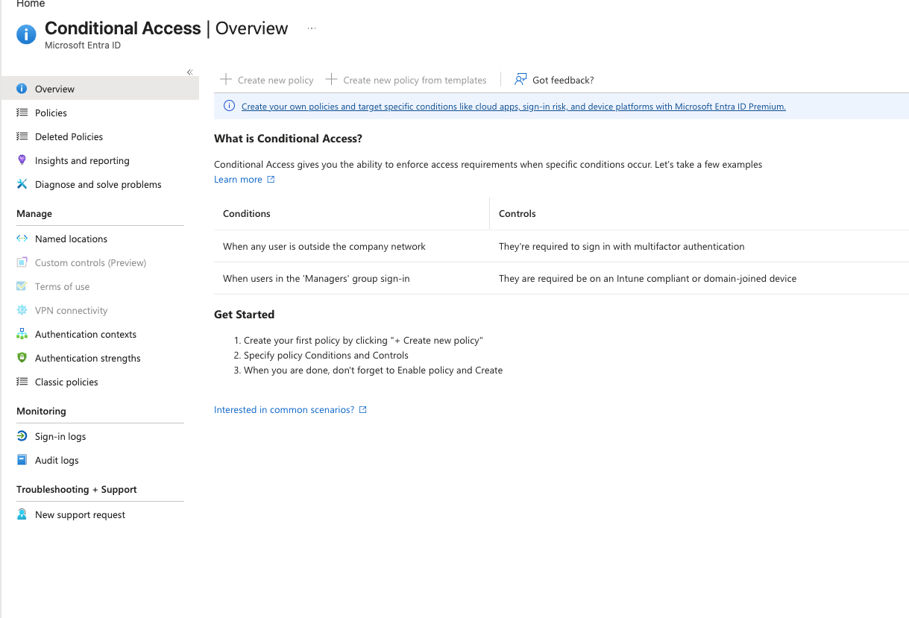

- Explored Conditional Access dashboard
- Learned how access policies enforce security (e.g., MFA)

Note:
- Full policy creation requires Entra ID Premium

---

##  6. Sign-in Monitoring

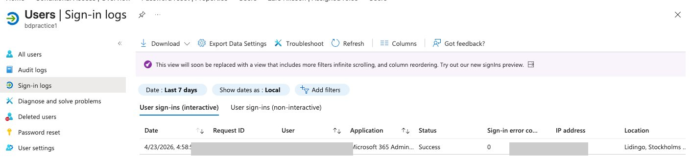

- Reviewed sign-in activity:
  - User logins
  - Applications accessed
  - Status (Success/Failure)

Sensitive data (IP, IDs) has been redacted.

---

##  Key Learnings

- User lifecycle management in Entra ID
- Role-Based Access Control (RBAC)
- Password reset workflows
- Device registration (Entra Join)
- Security monitoring with logs

---

##  Limitations

- No Intune license → No full MDM management
- No Entra ID Premium → Limited Conditional Access features

---

##  Conclusion

This lab demonstrates practical skills in:
- Identity & Access Management (IAM)
- IT Support operations
- Microsoft cloud administration

---

---

##  Tags

Entra ID, Azure AD, IT Support, Microsoft 365, Identity Management
